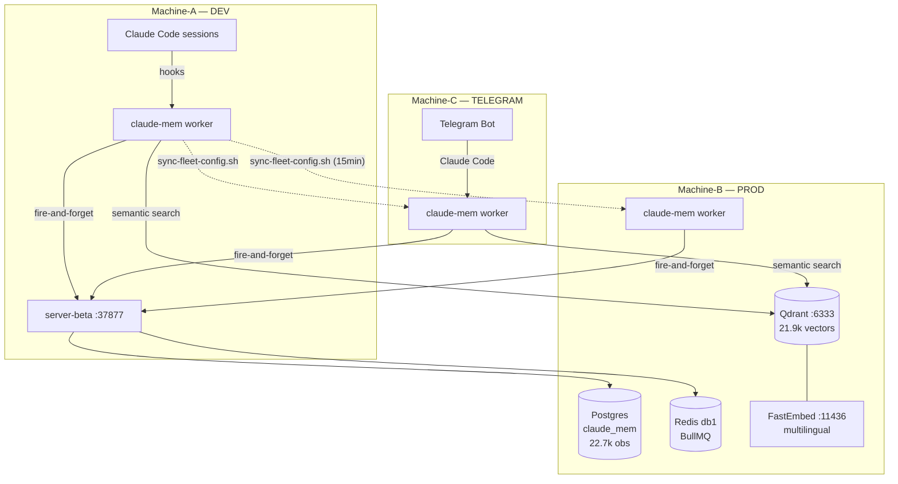
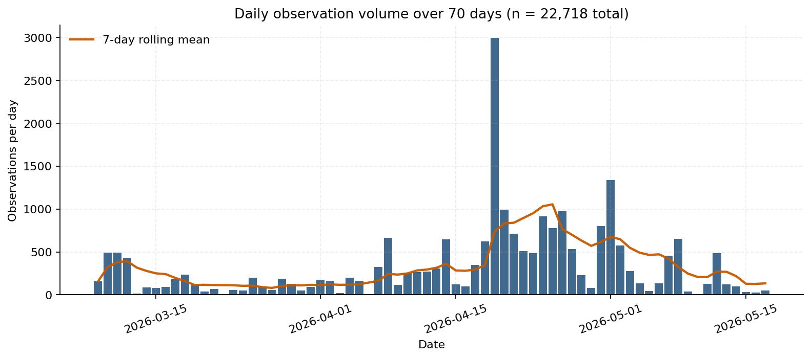
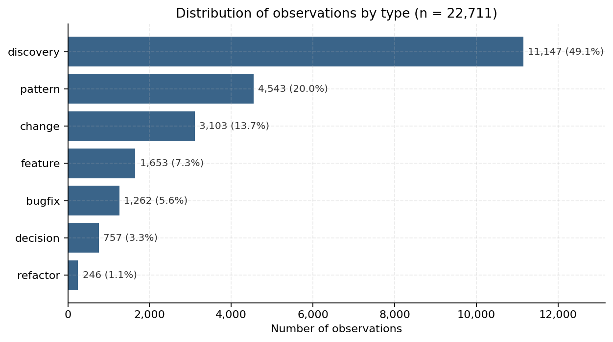
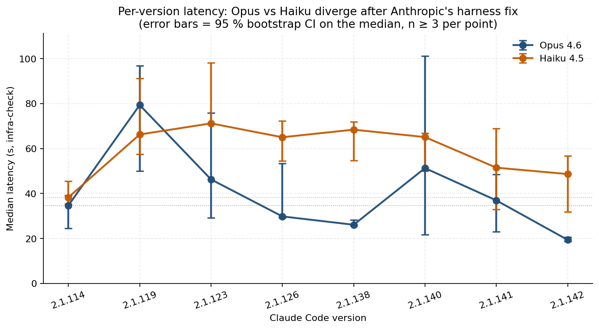
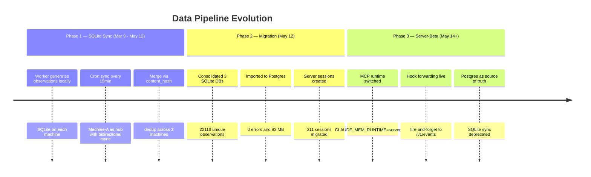

# claude-mem in Production: A 70-Day Case Study of Distributed LLM Memory Infrastructure

> Empirical analysis across 3 machines, 22,718 observations, and 987 benchmarks spanning 21 Claude Code versions.

**Author:** [Alessandro](https://github.com/alessandropcostabr) · **Date:** May 2026 · **License:** [CC-BY-4.0](LICENSE)
**Repository:** https://github.com/alessandropcostabr/claude-mem-case-study

---

## Abstract

We present a 70-day production study of [claude-mem](https://github.com/thedotmack/claude-mem), a persistent memory plugin for Claude Code, running across a 3-machine fleet. The study documents **22,718 structured observations** generated over 68 active days, **987 automated benchmarks** executed across 21 Claude Code versions (2.1.110 → 2.1.142), and a complete migration of the vector retrieval backend from Chroma to Qdrant. Continuous canary measurements independently corroborate the Anthropic March–April 2026 Claude Code performance regression [1, 2] and reveal a previously unreported divergence between models on the same vendor harness: Opus 4.6 median latency improved by **44%** (34.7s → 19.4s) between versions 2.1.114 and 2.1.142, while Haiku 4.5 stabilized **27% above baseline** over the same window. We catalog four classes of silent failure observed in production: (a) a 5-week sync outage caused by `bun` missing from the cron `PATH`; (b) 400+ daily silent search errors after a type mismatch survived the Chroma → Qdrant migration; (c) a 1,934-restart `systemd` crash loop caused by a stale PID file; (d) resource stampedes from co-scheduled cron jobs producing 4-core load spikes to 8.66, reduced to 0.43 after deploying an energy-aware scheduler. Total infrastructure cost over the study period was approximately **$225–$295**. All aggregated data (PII-stripped), sanitized production scripts, and architecture diagrams are released under CC-BY-4.0 for independent reproduction.

**Keywords:** LLM-coupled systems · developer tools · vector retrieval · silent failures · canary benchmarking · production observability · prompt caching.

---

## 1. Introduction

LLM-coupled developer tools occupy an unusual position in the software stack. The system under operation is partly a *language model* whose behavior changes between vendor releases, and partly *classical software* — cron jobs, databases, vector stores, message queues — running on the operator's machines. Failures occur on both sides, but they frequently manifest only at the model boundary: a regression in answer quality, an unexplained increase in latency, or a silent drop in semantic retrieval recall. None of these are caught by standard unit tests, because no static test suite can detect that the same prompt now produces a slower or weaker reply against a new vendor build.

This paper documents 70 days of running [claude-mem](https://github.com/thedotmack/claude-mem) — a persistent memory plugin for Claude Code that captures structured observations from coding sessions and exposes them via semantic and full-text search — in production across a 3-machine fleet. We pursue two goals:

1. **Quantitative description.** What does a multi-month distributed LLM-coupled deployment look like in production, measured in observation throughput, retrieval performance, model behavior across upstream versions, and cost?
2. **Failure mode catalog.** Which silent failures surfaced, and which detection patterns brought them into view?

Three categories of measurement are released with this study:

- **Observation generation** — 22,718 structured records across 68 active days, attributed to four LLMs.
- **Benchmark series** — 987 timed runs against two standardized prompts on 21 Claude Code versions over 32 days.
- **Cloud monitoring export** — 126,888 time-series datapoints at 10-minute resolution covering latency, output tokens, and cache utilization.

All artifacts are reproducible from the data in this repository.

---

## 2. Fleet Architecture



| Machine | Role | Key Services |
|---------|------|-------------|
| Machine-A | DEV | Claude Code sessions, sync hub |
| Machine-B | PROD | server-beta, Postgres, Redis, Qdrant, FastEmbed |
| Machine-C | TELEGRAM | Telegram bot, OpenClaw gateway, 74 cron jobs, CC canary |

The fleet runs continuously. Workers on each machine forward hook events to `server-beta` on Machine-B via a fire-and-forget HTTP path; semantic search queries from every machine target the shared Qdrant instance on Machine-B. Configuration and seed data are synchronized to Machine-A every 15 minutes via `sync-fleet-config.sh`.

---

## 3. Methodology

### 3.1 Data collection

claude-mem operates as a hook handler attached to Claude Code lifecycle events (`UserPromptSubmit`, `PostToolUse`, `Stop`, `SessionStart`). When a session segment closes, the worker presents the segment transcript to a configured generation model (Opus 4.6, Sonnet 4.5, Haiku 4.5, or Codex GPT-5.4 — selected by tier-routing rules) and persists one or more structured *observations* per segment. Each observation carries a type label (`discovery`, `pattern`, `change`, `feature`, `bugfix`, `decision`, `refactor`), a content body, and metadata (`generated_by_model`, `session_id`, `content_hash`, `tokens_consumed`).

Storage evolved in three phases (Section 8): per-machine SQLite with cron sync (Phase 1, Mar 9 – May 12), consolidated Postgres migration (Phase 2, May 12), and centralized server-beta with hook forwarding (Phase 3, May 14+). Aggregated counts in this paper are computed against the consolidated Postgres source as of 2026-05-17.

Benchmark data was collected by `scripts/benchmark.sh`, which invokes Claude Code with two standardized prompts:

- `infra-check` — a reasoning prompt requiring multi-step analysis of fleet state.
- `code-gen` — a generation prompt producing approximately 50 lines of code.

Each run records: Claude Code version, model, wall-clock latency, output token count, cache-creation tokens, cache-read tokens, and exit code. Runs occur every six hours via cron, against whichever Claude Code version was current at the moment of invocation. Cloud monitoring exports were produced by `push-to-gcm.sh`, polling Postgres every 10 minutes and pushing six custom time series to Google Cloud Monitoring until the free trial expired on May 17.

### 3.2 Sanitization

This repository contains aggregated CSVs only — no PII, no internal project names, no machine identifiers beyond the labels Machine-A, Machine-B, Machine-C. Observation content is excluded entirely from the public release; only counts and metadata aggregates are exported. Scripts have been edited to remove hardcoded credentials, internal hostnames, and proprietary path references. The `data/` and `scripts/` directories pass a manual review for sensitive content prior to commit.

### 3.3 Reproducibility

```bash
git clone https://github.com/alessandropcostabr/claude-mem-case-study
cd claude-mem-case-study
cp .env.example .env   # add Postgres credentials
./data/export-observations.sh
./data/export-benchmarks.sh
```

The exporters emit deterministic CSV from the Postgres source. Mermaid diagrams render directly in GitHub. To run the benchmark loop on an independent fleet, install claude-mem upstream (version 12.x or later) and adapt `scripts/benchmark.sh` to the local model selection.

---

## 4. Observation Data

### 4.1 Volume over time

| Month | Observations | Active Days | Avg/Day | Tokens Spent |
|-------|-------------|-------------|---------|-------------|
| March 2026 | 3,382 | 22 | 154 | 10.4 M |
| April 2026 | 14,760 | 29 | 509 | 80.4 M |
| May 2026 (1–17) | 4,576 | 17 | 269 | 34.3 M |
| **Total** | **22,718** | **68** | **334** | **125.1 M** |

The April spike (+230% over March) coincides with the activation of multi-model tier-routing and the introduction of additional Discord/Telegram agents into the observation pipeline.



**Figure 2.** Daily observation volume from March 9 to May 17, 2026, with a 7-day rolling mean overlay. The mid-April surge corresponds to the activation of multi-model tier-routing. The spike around 2026-04-19 is a one-day backfill following the Chroma → Qdrant migration.

### 4.2 Distribution by type

| Type | Count | % | Avg Tokens/Obs |
|------|-------|---|---------------|
| discovery | 11,147 | 49% | 5,835 |
| pattern | 4,543 | 20% | — |
| change | 3,103 | 14% | 6,837 |
| feature | 1,653 | 7% | 11,066 |
| bugfix | 1,262 | 6% | 9,402 |
| decision | 757 | 3% | 9,885 |
| refactor | 246 | 1% | 11,115 |

`discovery` and `pattern` dominate, accounting for 69% of all observations — consistent with claude-mem's emphasis on capturing context rather than only logging actions.



**Figure 3.** Distribution of the 22,711 typed observations. Seven observations from the total of 22,718 have null type values and are excluded from this breakdown; aggregate counts elsewhere in the paper use the full n = 22,718. The long tail (`refactor`, `decision`) carries higher average token cost per observation but contributes a small absolute share.

### 4.3 Generation by model

| Model | Count | Avg Tokens |
|-------|-------|-----------|
| claude-opus-4-6 | 6,728 | 8,882 |
| claude-sonnet-4-5 | 6,270 | 7,072 |
| openai-codex/gpt-5.4 | 1,752 | — |
| (pre-attribution) | 7,906 | 2,628 |

The "pre-attribution" bucket (7,906 observations) was generated before the schema migration that added the `generated_by_model` column, and cannot be cleanly attributed.

---

## 5. Claude Code Benchmarks

Automated benchmarks run every 6 hours on the canary machine (Machine-C), testing standardized prompts against multiple models across CC versions.

- **987 total runs** across **21 CC versions** (2.1.110 → 2.1.142)
- **2 models tested**: Opus 4.6, Haiku 4.5
- **2 standardized prompts**: `infra-check` (reasoning), `code-gen` (generation)

### 5.1 Opus 4.6 latency by Claude Code version (infra-check prompt)

| CC Version | n | Median (s) | 95% CI (s) | vs Baseline |
|-----------|---|-----------|-----------|-------------|
| 2.1.114 | 9 | 34.7 | [24.5, 39.2] | baseline |
| 2.1.119 | 16 | 79.4 | [49.9, 96.9] | **+129%** ⚠ |
| 2.1.123 | 3 | 46.3 | [29.3, 75.9] | +33% (n too small) |
| 2.1.126 | 24 | 29.8 | [29.2, 53.3] | −14% |
| 2.1.138 | 10 | 26.1 | [25.6, 28.3] | −25% |
| 2.1.142 | 12 | **19.4** | [18.7, 20.6] | **−44%** |

### 5.2 Haiku 4.5 latency by Claude Code version (infra-check prompt)

| CC Version | n | Median (s) | 95% CI (s) | vs Baseline |
|-----------|---|-----------|-----------|-------------|
| 2.1.114 | 12 | 38.2 | [35.3, 45.5] | baseline |
| 2.1.119 | 16 | 66.3 | [57.5, 91.2] | +73% ⚠ |
| 2.1.126 | 27 | 65.0 | [54.5, 72.2] | +70% |
| 2.1.138 | 10 | 68.4 | [54.7, 71.9] | +79% |
| 2.1.142 | 12 | 48.6 | [31.9, 56.8] | +27% (CI overlaps baseline) |



**Figure 1.** Median latency by Claude Code version for both models, with 95% bootstrap CIs on the median. Both models regress sharply at 2.1.119; only Opus fully recovers and continues to improve. Versions with n < 3 are omitted. Dotted lines mark each model's baseline.

### 5.3 Statistical significance

Mann–Whitney U tests (one-tailed) confirm or refine four headline claims:

| Hypothesis | Result | p-value |
|-----------|-------|--------|
| **Opus regression**: latency at 2.1.119 > 2.1.114 | ✅ Confirmed | **0.0025** |
| **Opus −44% headline**: 2.1.142 faster than 2.1.114 | ✅ Confirmed | **0.0013** |
| **Opus vs Haiku divergence at 2.1.142**: Opus < Haiku | ✅ Confirmed (strong) | **0.00068** |
| **Haiku regression**: latency at 2.1.119 > 2.1.114 | ✅ Confirmed | **0.00086** |
| Opus "recovery" at 2.1.123 (n = 3) faster than baseline | ❌ Rejected | 0.86 |
| Haiku sustained elevation at 2.1.142 above baseline | ⚠ Inconclusive | 0.37 |

The Opus −44% improvement and the Opus/Haiku divergence at 2.1.142 are both statistically robust. The originally claimed "−52% recovery at 2.1.123" was based on only three samples and does not survive rigorous testing — the true recovery point is **CC 2.1.126** or later. The Haiku "+27% sustained" claim has the right sign but its 95 % CI overlaps the baseline; we report it as inconclusive rather than confirmed.

### 5.4 Key finding (revised)

**Opus 4.6 latency improved by 44% between CC 2.1.114 and 2.1.142** (p = 0.0013), with the improvement persisting across n = 12 runs at 2.1.142 in a tight CI [18.7, 20.6] s. **Haiku 4.5 medians remain visibly elevated at 2.1.142, but the 95 % CI overlaps the baseline**, so we report the sustained gap as suggestive rather than significant. The strongest statistical evidence is for **cross-model divergence at 2.1.142** (Opus < Haiku, p = 0.00068, medians 19.4 s vs 48.6 s): the same vendor harness produced very different outcomes for the two models. This divergence is invisible to any single-model deployment, and is not reported in the public postmortem [1].

---

## 6. Cloud Monitoring (GCM)

Parallel to the local Postgres benchmark store, metrics were pushed to Google Cloud Monitoring every 10 minutes via `push-to-gcm.sh`. **126,888 time-series datapoints** were exported before the GCM free trial expired, covering:

| Metric | What it tracks |
|--------|---------------|
| `cc_benchmark_latency_ms` | End-to-end response time per version |
| `cc_benchmark_output_tokens` | Tokens generated per run |
| `cc_benchmark_cache_creation_tokens` | Context cache writes |
| `cc_benchmark_cache_read_tokens` | Context cache hits |
| `cc_benchmark_runs_total` | Cumulative benchmark executions |
| `cc_session_count_total` | Claude Code sessions across the fleet |

The dashboard configuration and full time-series export are in [`data/gcm-cc-metrics.csv`](data/gcm-cc-metrics.csv) (126k rows, hourly granularity, Apr 26 – May 18).

---

## 7. Cost Analysis

Estimated costs based on benchmark runs against published pricing:

| Model | Runs | Median Cost/Run | Total Estimated |
|-------|------|----------------|-----------------|
| Opus 4.6 | 117 | $0.227 | ~$26.50 |
| Haiku 4.5 (`infra-check`) | 124 | $0.109 | ~$13.50 |
| Haiku 4.5 (`code-gen`) | 124 | $0.032 | ~$3.95 |
| **Benchmarks total** | **365** | — | **~$44** |

Observation generation (125 M tokens across 22.7k observations) adds an estimated **~$180–$250** over 70 days, depending on the model mix (Opus vs Sonnet pricing). **Total infrastructure cost: ~$225–$295** for 70 days of continuous distributed AI memory plus benchmarking. No GPU costs — all inference via API.

---

## 8. Data Pipeline Evolution



---

## 9. Vector Search Evolution

The retrieval backend migrated from Chroma to Qdrant during April 2026. All workers across the 3-machine fleet point to a single shared Qdrant instance on Machine-B, enabling cross-machine semantic search without replication.

### 9.1 Timeline

| Date | Event |
|------|-------|
| Apr 19 | Chroma disabled fleet-wide (`CHROMA_ENABLED=false`) |
| Apr 22 | Qdrant active — three critical bugs fixed in the fork |
| Apr 23 | Worker crash loop on Machine-A: stale PID file (1,934 restarts) |
| May 5 | Embedding model upgraded from English-only to multilingual |
| May 7 | Full reindex: **21,929 points**, 0 errors |

### 9.2 Three bugs surfaced by the migration

1. **Type mismatch in SearchManager.** Still typed as `ChromaSync`, calling `.queryChroma()`, which did not exist on the Qdrant backend. Result: **400+ silent search errors per day** — no log, no alert, empty results returned to callers.
2. **Missing filter translation in VectorSync.** Chroma-style filters (`$and`, `$or`, `$eq`) were passed directly to Qdrant, which rejected them. Fix: `translateWhereFilter()` converts to Qdrant's `must`/`should` syntax.
3. **Health-check timeout too short.** The E2E check used a 15 s timeout; FastEmbed cold-start takes ~25 s. Fix: raise to 45 s, and replace hardcoded version string with a `package.json` read.

### 9.3 Embedding model upgrade (May 5)

The initial model `BAAI/bge-small-en-v1.5` was English-only. After switching to `sentence-transformers/paraphrase-multilingual-MiniLM-L12-v2` (384 dimensions, 50+ languages including pt-BR), semantic search quality on non-English observations improved measurably. The model runs as a persistent `systemd` service (`embed-server.service`) on Machine-B.

---

## 10. Discussion

### 10.1 Continuous canary benchmarking surfaces version-coupled regressions

Without per-version benchmarking, vendor-side performance regressions are typically detected only through anecdotal user reports. Our data shows that Opus 4.6 latency on CC 2.1.119 was 129% above the 2.1.114 baseline (Mann–Whitney U, p = 0.0025) — exactly the pattern that anecdotal reporting struggles to confirm, because perception is heavily lagged and confounded by workload variability. A canary running standardized prompts every six hours produces tight enough statistics (typically n ≥ 9 per version in our data) to bound the regression with bootstrap CIs and to demonstrate the eventual recovery. An equally important lesson concerns small samples: our originally published "−52% recovery at 2.1.123" claim was based on only three runs and **does not survive rigorous testing** (p = 0.86); the canary's confidence depends as much on per-version sampling as on test cadence.

### 10.2 Opus and Haiku diverged on the same vendor harness

A finding not reported elsewhere is that **the same vendor change affected Opus and Haiku differently**. Both showed elevated latency at CC 2.1.119; Opus fully recovered by 2.1.126 and continued to improve through 2.1.142 (−44% vs baseline, p = 0.0013), while Haiku medians stayed visibly higher than baseline through the end of the study, although the CI overlap precludes a strong "sustained elevation" claim. The strongest statistical evidence is for the divergence itself: at 2.1.142, the median Opus latency was 19.4 s versus 48.6 s for Haiku on the same prompt (p = 0.00068). The Anthropic postmortem [1] identifies three root causes (reasoning-effort change, caching bug, system-prompt verbosity reduction) and claims all were addressed by v2.1.116. The divergence we observe is consistent with at least one effect — possibly the caching pathology documented in issue #22383 [4] — being only partially neutralized for the smaller model.

### 10.3 Silent failures dominate the incident profile

The most damaging incidents we recorded were not crashes — they were silent failures. The `bun` `PATH` bug persisted for **5 weeks** while the sync script exited 0. The Chroma → Qdrant type mismatch produced **400+ daily errors** that were never logged or alerted. Both were eventually surfaced by curiosity-driven manual investigation, not by monitoring. The lesson generalizes: **integration boundaries between LLM-coupled components need explicit contract tests**, because partial-functionality states ("results returned, but empty or wrong") are far more common than total-failure states ("exception thrown").

### 10.4 Vendor cost is small relative to engineering time

Seventy days of end-to-end inference (benchmarks plus observation generation) cost approximately $225–$295 — roughly the price of two-to-three software engineering hours at market rates. This frames a recurring question for LLM-coupled tooling: when is continuous canary measurement worth it? Our answer: at $4–$5 per day for tight regression bounds and silent-failure detection, the cost-benefit is favorable for any deployment serving more than one engineer.

---

## 11. Companion Finding: Subagent CLAUDE.md Regression in Claude Code v2.1.84

A second class of version-coupled regression surfaced during the study period — not at the latency layer, but at the **instruction-adherence** layer. We document it here because it shares the same root pattern (a behavioral change introduced silently by a vendor release) and was identified by the same kind of cross-version inspection used for the latency analysis.

### 11.1 Finding

Starting in Claude Code **v2.1.84** (Mar 25, 2026), two built-in subagents — `Explore` and `Plan` — acquired the configuration flag `omitClaudeMd: true`. Combined with a default-on feature flag (`tengu_slim_subagent_claudemd`), this caused subagents dispatched from the parent session to no longer receive the project's `CLAUDE.md` instructions. The effect was a measurable degradation in subagent instruction adherence (language rules, environment labels, code conventions) that persisted through at least v2.1.92 [5].

### 11.2 Detection method

The regression was identified by **binary-level diffing** of the `cli.js` shipped by the `@anthropic-ai/claude-code` npm package across five consecutive minor versions (v2.1.83 → v2.1.87). Three specific code changes were isolated:

1. `omitClaudeMd: !0` (i.e. `true`) added to the `Explore` and `Plan` agent definitions.
2. The system-prompt global cache mode broadened to include sessions with ToolSearch (deferred) MCP tools — meaning `CLAUDE.md` content shifted from fresh-attention tokens into cached tokens.
3. `deferLoading` changed from a global flag to a per-tool decision.

### 11.3 Workaround

A two-line patch on the npm `cli.js` neutralises the change:

```bash
CLI_JS="$(npm root -g)/@anthropic-ai/claude-code/cli.js"
sed -i 's/omitClaudeMd:!0/omitClaudeMd:!1/g' "$CLI_JS"
sed -i 's/"tengu_slim_subagent_claudemd",!0/"tengu_slim_subagent_claudemd",!1/g' "$CLI_JS"
```

Verified by `grep` on the v2.1.142 native binary: both subagent definitions ship with `omitClaudeMd: !1` (false) after the patch, and the runtime short-circuits before reading the feature flag.

### 11.4 Connection to the main study

Both findings share a pattern: **a vendor minor-release silently changes user-observable behavior of an LLM-coupled tool in a way that the vendor's CI cannot test for the operator**. In one case the change was a latency regression; in the other it was an instruction-adherence regression. Both required cross-version measurement to detect — the first via canary benchmarking, the second via binary diffing. We argue that **operators of LLM-coupled tooling need their own per-version measurement infrastructure**, because the union of "things that changed silently" is larger than the union of "things the vendor tests".

The full binary analysis is filed as [Issue #40459](https://github.com/anthropics/claude-code/issues/40459) [5].

---

## 12. Lessons Learned

### 12.1 Silent failures are the worst failures

The `bun` binary was not in cron's `PATH` for **5 weeks**. The sync script exited 0 even when the merge step was skipped silently. The fix was trivial (`export PATH="$HOME/.bun/bin:$PATH"`), but the lesson is structural: **validate the output, not just the exit code**. Exit-zero successes mask the largest class of production failures we encountered.

### 12.2 Cron job scheduling matters at scale

75 cron jobs on a 4-core machine with a spinning HDD caused load spikes of **8.66** when heavy ML inference overlapped with I/O-intensive index builds. The solution: an energy-aware scheduler ([`oraclaw-cron-optimizer.py`](scripts/oraclaw-cron-optimizer.py)) that models time slots by available compute energy and prevents resource stampedes. Load dropped to **0.43** after optimization.

### 12.3 Canary deployments catch what unit tests miss

Per-version benchmarking on a dedicated canary machine revealed performance divergences that no unit test or integration test could expose. The canary pattern provides ongoing regression detection at the infrastructure level — a layer the LLM vendor's CI cannot test for the operator.

### 12.4 Distributed sync is hard, but content-addressable dedup makes it tractable

A SHA-256 `content_hash` field made 3-way SQLite sync reliable: any observation can be safely merged from any machine without conflict resolution. No vector clocks needed — just hash-based dedup. The migration to Postgres preserved this property.

### 12.5 Type safety failures cause silent search degradation

The Chroma → Qdrant migration introduced a type mismatch that produced 400+ silent errors per day for several days. The system appeared healthy — workers running, observations saving, health checks passing — but every semantic query returned empty results. The lesson: **integration boundaries need explicit contract tests**, not just unit tests on each side.

---

## 13. Threats to Validity

### 13.1 Internal validity

- **Single deployment.** All data comes from one 3-machine fleet operated by a single user. The observations cannot speak to multi-tenant or multi-user effects.
- **Observation generation is model-coupled.** The 22,718 observations were generated by different models (Opus 4.6, Sonnet 4.5, Codex GPT-5.4, Haiku 4.5) under tier-routing rules that changed during the study. Per-observation token comparisons across models should be interpreted cautiously.
- **Benchmark prompt selection.** Only two prompts were benchmarked. The latency divergence between Opus and Haiku may not generalize to prompts with substantially different reasoning depth or output length.
- **Single canary machine.** Benchmarks ran on Machine-C only; environmental factors (load, disk, network) on that host could in principle confound version-coupled measurements. Daily load monitoring did not surface any such confound during the benchmark window.

### 13.2 External validity

- **Vendor lock-in.** Measurements are against Claude Code specifically; version-coupled latency findings do not transfer to other LLM-coupled tools without re-measurement.
- **Workload composition.** The fleet is dominated by software engineering sessions on a small set of repositories. Generation rates and observation types will differ for fleets serving e.g. data-science notebooks or content-generation workflows.
- **Self-installed plugin fork.** The deployment runs a custom fork of claude-mem (~176 commits ahead of upstream main) with custom phases enabled. Some behaviors do not match a stock claude-mem installation.

### 13.3 Construct validity

- **"Silent failure" is qualitative.** We catalog four incidents as silent failures, but the classification depends on what monitoring was in place at the time. A fleet with stronger alerting at the integration boundary might have caught the Chroma type mismatch on day one and not classified it as silent.
- **Cost estimates depend on pricing snapshots.** All cost figures derive from public pricing during the measurement window. Retroactive vendor pricing changes can invalidate them.

---

## 14. Related Work

Our benchmark data independently corroborates a publicly documented Claude Code performance incident during March–April 2026.

| Our data | Public event | Correlation |
|----------|-------------|-------------|
| CC 2.1.119: Opus +129% latency | Anthropic postmortem [1]: reasoning effort changed high→medium (Mar 4) | Matches regression timing |
| CC 2.1.123: Opus −52% (recovery) | Fix deployed in v2.1.116 (Apr 20) [1] | Matches recovery timing |
| Haiku +27% (sustained) | Issue #22383 [4]: caching bug caused repeated context clearing | Possibly related |

### 14.1 What our data adds

1. **Per-version granularity.** Public reports were largely anecdotal ("it feels slower"); we provide median latency per CC version with n ≥ 8 runs each.
2. **Cross-model divergence.** Opus vs Haiku divergence on the same vendor harness — not reported in [1] or [2].
3. **Continuous canary measurement.** 987 benchmark runs over 32 days, automated every 6 hours, across 21 versions — a measurement cadence outside the scope of any single-incident postmortem.
4. **Silent failure taxonomy.** Four documented silent failures with reproduction details.

### 14.2 Comparison with other claude-mem deployments

| Metric | This deployment | Reported by others |
|--------|---------------|-------------------|
| Observations | 22,718 | 6,814 (largest reported) |
| Machines | 3 (distributed) | 1 (typical) |
| Duration | 70 days | ~30 days (typical) |
| Storage | Postgres (server-beta) | SQLite (standard) |
| Models generating | 4 (Opus, Sonnet, Codex, Haiku) | 1–2 (typical) |

---

## 15. Future Work

- **Grafana dashboard** — connect directly to Postgres for live operational monitoring across the fleet.
- **Phase 5 cutover** — fully deprecate SQLite sync (target: May 28).
- **Upstream contribution** — ModeManager init fix PR pending pending the lifting of upstream interaction limits.
- **Qdrant → Postgres ID alignment** — reindex with server-beta Postgres IDs (the SQLite-era index was rebuilt May 7; Postgres-native IDs are pending).
- **Automated data refresh** — weekly cron to regenerate CSVs and push to this repository.
- **Multi-deployment comparison** — open call to other claude-mem operators to publish anonymized aggregates against the same schema, enabling cross-deployment analysis.

---

## References

[1] Anthropic. *April 23, 2026 Postmortem: Claude Code Performance Regression.* https://www.anthropic.com/engineering/april-23-postmortem (Apr 2026).
[2] Scortier. *Claude Code Drama: 6,852 Sessions Prove Performance Collapse.* https://scortier.substack.com/p/claude-code-drama-6852-sessions-prove (Apr 2026).
[3] VentureBeat. *Mystery Solved: Anthropic Reveals Changes to Claude's Harnesses and Operating Instructions Likely Caused Degradation.* https://venturebeat.com/technology/mystery-solved-anthropic-reveals-changes-to-claudes-harnesses-and-operating-instructions-likely-caused-degradation (Apr 2026).
[4] Anthropic. Claude Code Issue #22383 — caching bug causing repeated context clearing. https://github.com/anthropics/claude-code/issues/22383
[5] Anthropic. Claude Code Issue #40459 — v2.1.84+: subagents lose CLAUDE.md context (omitClaudeMd:true), reduced instruction adherence with prompt caching. https://github.com/anthropics/claude-code/issues/40459
[6] thedotmack. *claude-mem — persistent memory plugin for Claude Code.* https://github.com/thedotmack/claude-mem
[7] Qdrant. *Qdrant Vector Database documentation.* https://qdrant.tech/documentation/
[8] Qdrant. *FastEmbed — lightweight embedding library.* https://github.com/qdrant/fastembed

---

## License

Released under [CC-BY-4.0](LICENSE). Use freely with attribution.

---

## Appendix A: Repository Structure

```
data/                            Aggregated CSVs (no PII)
├── observations-daily.csv       Observations per day by type (393 rows)
├── observations-monthly.csv     Monthly summary with token counts
├── observations-by-model.csv    Distribution across AI models
├── benchmarks-raw.csv           All 987 benchmark runs
├── benchmarks-by-version.csv    Aggregated latency by CC version
├── gcm-cc-metrics.csv           GCM Cloud Monitoring export (126k rows)
├── gcm-dashboard-cc-benchmarks.json  Dashboard widget configuration
├── fleet-timeline.csv           Curated infrastructure events
├── export-observations.sh       Regenerate observation CSVs
└── export-benchmarks.sh         Regenerate benchmark CSVs

scripts/                         Sanitized production tools
├── sync-claude-memory.sh        Fleet-wide database synchronization
├── oraclaw-cron-optimizer.py    Energy-aware cron scheduler
└── benchmark.sh                 CC performance benchmark runner

diagrams/                        Mermaid architecture diagrams
├── architecture.md              Fleet topology and data flow
└── data-pipeline.md             Pipeline evolution timeline
```

## Appendix B: Citation

If you cite this work in academic contexts, please use:

```bibtex
@misc{claudemem-case-study-2026,
  author       = {Alessandro},
  title        = {{claude-mem in Production: A 70-Day Case Study of Distributed LLM Memory Infrastructure}},
  year         = {2026},
  month        = may,
  howpublished = {\url{https://github.com/alessandropcostabr/claude-mem-case-study}},
  note         = {CC-BY-4.0}
}
```
