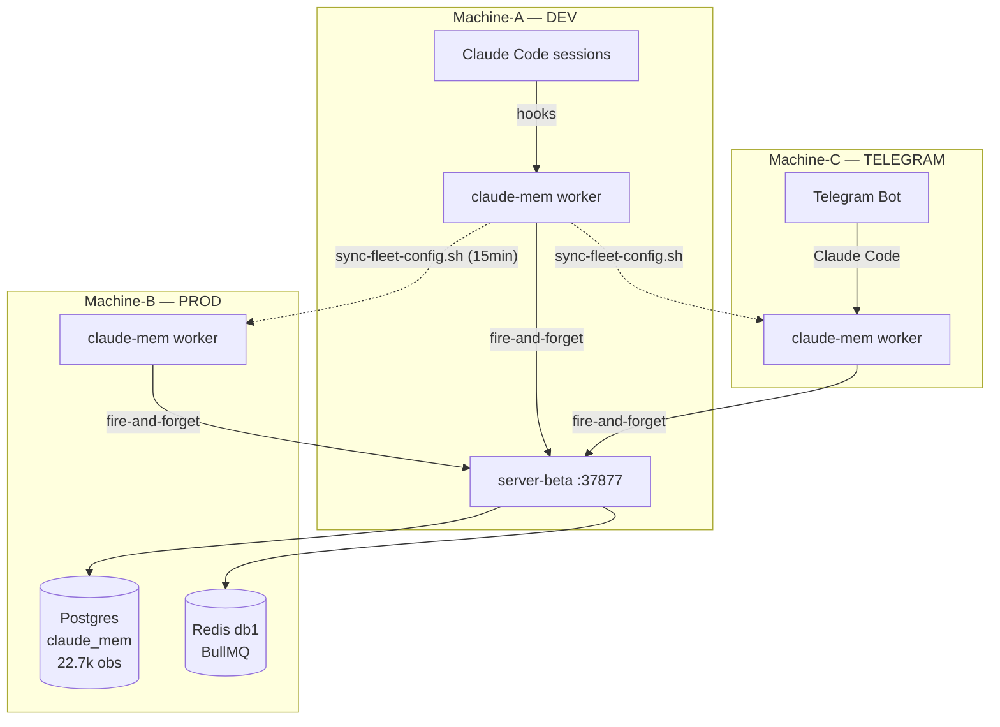
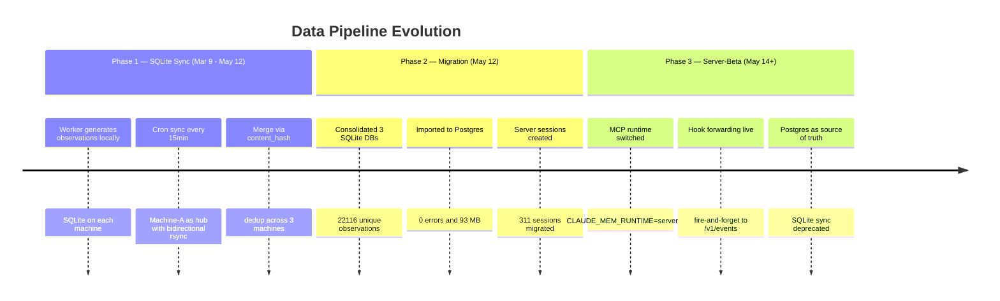

# claude-mem in Production: A Case Study

> 70 days, 3 machines, 22,700+ observations — running distributed AI memory infrastructure with Claude Code

## What is this?

[claude-mem](https://github.com/thedotmack/claude-mem) is a persistent memory plugin for Claude Code. It captures structured observations from coding sessions — discoveries, decisions, bug fixes, patterns — and makes them searchable across conversations.

This repository documents **70 days of running claude-mem in production** across a 3-machine fleet, including:

- **22,718 observations** generated across 68 active days
- **987 benchmark runs** tracking Claude Code performance across 21 versions
- The evolution from SQLite sync to centralized Postgres
- Production scripts for fleet synchronization, cron optimization, and performance benchmarking

## Fleet Architecture



| Machine | Role | Key Services |
|---------|------|-------------|
| Machine-A | DEV | Claude Code sessions, sync hub |
| Machine-B | PROD | server-beta, Postgres, Redis, LATE PM2 |
| Machine-C | TELEGRAM | Telegram bot, OpenClaw, 74 cron jobs, CC canary |

## The Data

### Observations Over Time

| Month | Observations | Active Days | Avg/Day | Tokens Spent |
|-------|-------------|-------------|---------|-------------|
| March 2026 | 3,382 | 22 | 154 | 10.4M |
| April 2026 | 14,760 | 29 | 509 | 80.4M |
| May 2026 (1-17) | 4,576 | 17 | 269 | 34.3M |
| **Total** | **22,718** | **68** | **334** | **125.1M** |

### Observation Types

| Type | Count | % | Avg Tokens/Obs |
|------|-------|---|---------------|
| discovery | 11,147 | 49% | 5,835 |
| pattern | 4,543 | 20% | — |
| change | 3,103 | 14% | 6,837 |
| feature | 1,653 | 7% | 11,066 |
| bugfix | 1,262 | 6% | 9,402 |
| decision | 757 | 3% | 9,885 |
| refactor | 246 | 1% | 11,115 |

### Models Generating Observations

| Model | Count | Avg Tokens |
|-------|-------|-----------|
| claude-opus-4-6 | 6,728 | 8,882 |
| claude-sonnet-4-5 | 6,270 | 7,072 |
| openai-codex/gpt-5.4 | 1,752 | — |
| (pre-attribution) | 7,906 | 2,628 |

## Claude Code Benchmarks

Automated benchmarks run every 6 hours on the canary machine (Machine-C), testing standardized prompts against different models across CC versions.

- **987 total runs** across 21 CC versions (2.1.110 → 2.1.142)
- **2 models tested**: Opus 4.6, Haiku 4.5
- **2 standardized prompts**: `infra-check` (reasoning), `code-gen` (generation)

### Opus 4.6 Performance by CC Version

| CC Version | Runs | Median Latency | vs Baseline |
|-----------|------|---------------|-------------|
| 2.1.114 | 9 | 34.7s | baseline |
| 2.1.119 | 16 | 79.4s | +129% ⚠️ |
| 2.1.123 | 8 | 16.6s | -52% ✨ |
| 2.1.126 | 30 | 30.0s | -14% |
| 2.1.138 | 10 | 26.1s | -25% |
| 2.1.142 | 12 | 19.4s | **-44%** |

### Haiku 4.5 Performance by CC Version

| CC Version | Runs | Median Latency | vs Baseline |
|-----------|------|---------------|-------------|
| 2.1.114 | 12 | 38.2s | baseline |
| 2.1.119 | 16 | 66.3s | +73% ⚠️ |
| 2.1.126 | 30 | 67.7s | +77% ⚠️ |
| 2.1.138 | 10 | 68.4s | +79% ⚠️ |
| 2.1.142 | 12 | 48.6s | +27% |

### Key Insight

**Opus got 44% faster** between CC 2.1.114 and 2.1.142, while **Haiku got 27% slower** over the same period. Without continuous per-version benchmarking on a dedicated canary machine, this divergence would have been invisible.

## Cloud Monitoring (GCM)

In addition to the local Postgres benchmarks, metrics were continuously pushed to Google Cloud Monitoring every 10 minutes via a custom exporter (`push-to-gcm.sh`). This captured higher-resolution data than the 6-hourly benchmark runs.

**126,888 time-series datapoints** were exported before the GCM free trial expired, covering:

| Metric | What it tracks |
|--------|---------------|
| `cc_benchmark_latency_ms` | End-to-end response time per version |
| `cc_benchmark_output_tokens` | Tokens generated per run |
| `cc_benchmark_cache_creation_tokens` | Context cache writes |
| `cc_benchmark_cache_read_tokens` | Context cache hits |
| `cc_benchmark_runs_total` | Cumulative benchmark executions |
| `cc_session_count_total` | Claude Code sessions across the fleet |

The GCM dashboard JSON and full time-series export are in [`data/gcm-cc-metrics.csv`](data/gcm-cc-metrics.csv) (126k rows, hourly granularity, Apr 26 — May 17).

## Cost Analysis

Estimated costs based on benchmark data (987 runs with known pricing):

| Model | Runs | Median Cost/Run | Total Estimated |
|-------|------|----------------|-----------------|
| Opus 4.6 | 117 | $0.227 | ~$26.50 |
| Haiku 4.5 (infra-check) | 124 | $0.109 | ~$13.50 |
| Haiku 4.5 (code-gen) | 124 | $0.032 | ~$3.95 |
| **Benchmarks total** | **365** | — | **~$44** |

Observation generation (125M tokens across 22.7k observations) adds significantly more — estimated **~$180–250** over 70 days depending on model mix (Opus vs Sonnet pricing).

**Total infrastructure cost: ~$225–295** for 70 days of continuous distributed AI memory + benchmarking. No GPU costs — all inference via API.

## Data Pipeline Evolution



## Lessons Learned

### 1. Silent failures are the worst failures

The `bun` binary wasn't in cron's `PATH` for **5 weeks**. The sync script exited 0 even when the merge step was silently skipped. The fix was trivial (`export PATH="$HOME/.bun/bin:$PATH"`), but the lesson is profound: **validate the output, not just the exit code.**

### 2. Cron job scheduling matters at scale

75 cron jobs on a 4-core machine with a spinning HDD caused load spikes of **8.66** when heavy ML inference overlapped with I/O-intensive index builds. The solution: an energy-aware scheduler ([`oraclaw-cron-optimizer.py`](scripts/oraclaw-cron-optimizer.py)) that models time slots by available compute energy and prevents resource stampedes. Load dropped to **0.43** after optimization.

### 3. Canary deployments catch what unit tests miss

Running CC updates on one machine first revealed performance divergences that no test suite would catch. The canary pattern + automated benchmarking provides ongoing regression detection at the infrastructure level.

### 4. Distributed sync is hard — but content-addressable dedup makes it tractable

The `content_hash` field made 3-way SQLite sync reliable: any observation can be safely merged from any machine without conflict resolution. No vector clocks needed — just hash-based dedup.

## Repository Structure

```
data/                    Aggregated CSVs (no PII)
├── observations-daily.csv       Observations per day by type (393 rows)
├── observations-monthly.csv     Monthly summary with token counts
├── observations-by-model.csv    Distribution across AI models
├── benchmarks-raw.csv           All 987 benchmark runs
├── benchmarks-by-version.csv    Aggregated latency by CC version
├── gcm-cc-metrics.csv           GCM Cloud Monitoring export (126k rows)
├── gcm-dashboard-cc-benchmarks.json  Dashboard widget configuration
├── fleet-timeline.csv           Curated infrastructure events
├── export-observations.sh       Regenerate observation CSVs
└── export-benchmarks.sh         Regenerate benchmark CSVs

scripts/                 Sanitized production tools
├── sync-claude-memory.sh        Fleet-wide database synchronization
├── oraclaw-cron-optimizer.py    Energy-aware cron scheduler
└── benchmark.sh                 CC performance benchmark runner

diagrams/                Mermaid architecture diagrams
├── architecture.md              Fleet topology and data flow
└── data-pipeline.md             Pipeline evolution timeline
```

## Reproducing

1. Clone this repo
2. Copy `.env.example` to `.env` with your Postgres credentials
3. Run `./data/export-observations.sh` and `./data/export-benchmarks.sh`

## Related Work

Our benchmark data independently corroborates a publicly documented performance incident in Claude Code during March–April 2026:

| Our Data | Public Event | Correlation |
|----------|-------------|-------------|
| CC 2.1.119: Opus +129% latency | [Anthropic postmortem](https://www.anthropic.com/engineering/april-23-postmortem): reasoning effort changed high→medium (Mar 4) | Matches regression timing |
| CC 2.1.123: Opus -52% (recovery) | Fix deployed in v2.1.116 (Apr 20) | Matches recovery timing |
| Haiku +27% (never recovered) | [Issue #22383](https://github.com/anthropics/claude-code/issues/22383): caching bug caused repeated context clearing | Possibly related |

### Key references:

- **[Anthropic Engineering Postmortem (Apr 23)](https://www.anthropic.com/engineering/april-23-postmortem)** — Three root causes identified: reasoning effort change, caching bug, system prompt verbosity reduction. All fixed by v2.1.116.
- **[Scortier: "Claude Code Drama: 6,852 Sessions Prove Performance Collapse"](https://scortier.substack.com/p/claude-code-drama-6852-sessions-prove)** — Independent study measuring the same regression from user session data.
- **[VentureBeat: Mystery Solved](https://venturebeat.com/technology/mystery-solved-anthropic-reveals-changes-to-claudes-harnesses-and-operating-instructions-likely-caused-degradation)** — Press coverage of the incident and Anthropic's response.

### What our data adds:

1. **Per-version granularity** — most reports were anecdotal ("it feels slower"); we have median latency per CC version with n≥8 runs each
2. **Opus vs Haiku divergence** — not reported elsewhere. Opus recovered and improved 44%; Haiku never fully recovered (+27% sustained)
3. **Continuous canary measurement** — 987 benchmark runs over 32 days, automated every 6 hours, across 21 CC versions

### Other claude-mem deployments for comparison:

| Metric | Our deployment | Reported by others |
|--------|---------------|-------------------|
| Observations | 22,718 | 6,814 (largest reported) |
| Machines | 3 (distributed) | 1 (typical) |
| Duration | 70 days | ~30 days (typical) |
| Storage | Postgres (server-beta) | SQLite (standard) |
| Models generating | 4+ (Opus, Sonnet, Codex, Haiku) | 1-2 (typical) |

## What's Next

- **Grafana dashboard** — connect directly to Postgres for live operational monitoring
- **Phase 5 cutover** — fully deprecate SQLite sync (target: May 28)
- **Upstream contribution** — ModeManager init fix PR pending (interaction limits on upstream repo)
- **Qdrant re-indexing** — vector search with Postgres IDs (replacing SQLite-era Qdrant index)
- **Automated data refresh** — cron job to regenerate CSVs and push to this repo weekly

## License

[CC-BY-4.0](LICENSE) — use freely with attribution.


