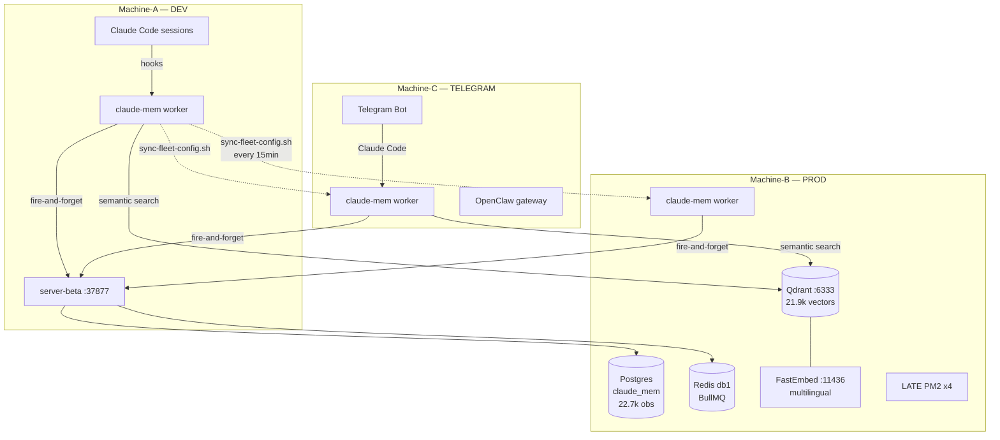
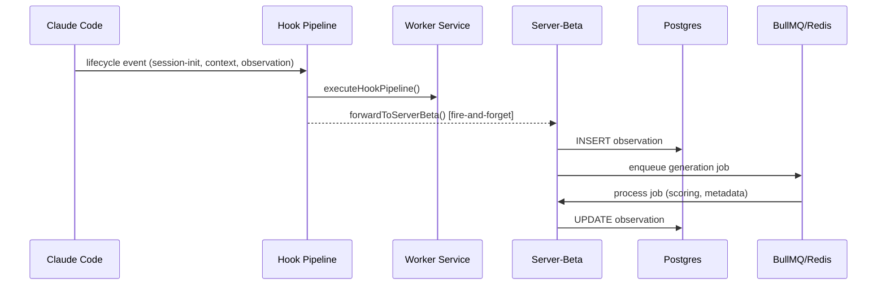

# Fleet Architecture

## Machine Topology

```mermaid
graph TB
    subgraph Machine-A ["Machine-A — DEV"]
        W1[claude-mem worker]
        CC1[Claude Code sessions]
        CC1 -->|hooks| W1
        W1 -->|fire-and-forget| SB
    end

    subgraph Machine-B ["Machine-B — PROD"]
        SB[server-beta :37877]
        PG[(Postgres<br/>claude_mem<br/>22.7k obs)]
        RD[(Redis db1<br/>BullMQ)]
        QD[(Qdrant :6333<br/>21.9k vectors)]
        FE[FastEmbed :11436<br/>multilingual]
        PM[LATE PM2 x4]
        W2[claude-mem worker]
        SB --> PG
        SB --> RD
        W2 -->|fire-and-forget| SB
        QD --- FE
    end

    subgraph Machine-C ["Machine-C — TELEGRAM"]
        W3[claude-mem worker]
        TG[Telegram Bot]
        OC[OpenClaw gateway]
        W3 -->|fire-and-forget| SB
        TG -->|Claude Code| W3
    end

    W1 -.->|sync-fleet-config.sh<br/>every 15min| W2
    W1 -.->|sync-fleet-config.sh| W3
    W1 -->|semantic search| QD
    W3 -->|semantic search| QD
```

## Data Flow

```mermaid
sequenceDiagram
    participant CC as Claude Code
    participant Hook as Hook Pipeline
    participant Worker as Worker Service
    participant SB as Server-Beta
    participant PG as Postgres
    participant BQ as BullMQ/Redis

    CC->>Hook: lifecycle event (session-init, context, observation)
    Hook->>Worker: executeHookPipeline()
    Hook-->>SB: forwardToServerBeta() [fire-and-forget]
    SB->>PG: INSERT observation
    SB->>BQ: enqueue generation job
    BQ->>SB: process job (scoring, metadata)
    SB->>PG: UPDATE observation
```
