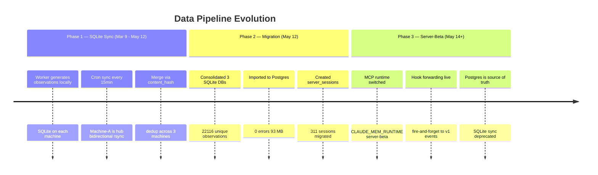
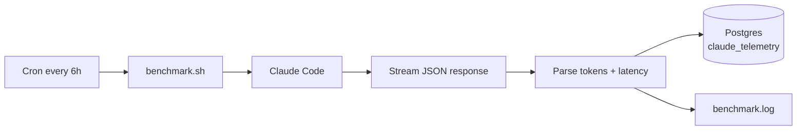

# Data Collection Pipeline

## Evolution: SQLite to Postgres

```mermaid
timeline
    title Data Pipeline Evolution
    section Phase 1 — SQLite Sync (Mar 9 - May 12)
        Worker generates observations locally : SQLite on each machine
        Cron sync every 15min : Machine-A is hub bidirectional rsync
        Merge via content_hash : dedup across 3 machines
    section Phase 2 — Migration (May 12)
        Consolidated 3 SQLite DBs : 22116 unique observations
        Imported to Postgres : 0 errors 93 MB
        Created server_sessions : 311 sessions migrated
    section Phase 3 — Server-Beta (May 14+)
        MCP runtime switched : CLAUDE_MEM_RUNTIME server-beta
        Hook forwarding live : fire-and-forget to v1 events
        Postgres is source of truth : SQLite sync deprecated
```

## Benchmark Pipeline

```mermaid
graph LR
    CRON[Cron every 6h] --> BENCH[benchmark.sh]
    BENCH --> CC[Claude Code]
    CC --> STREAM[Stream JSON response]
    STREAM --> PARSE[Parse tokens + latency]
    PARSE --> PG[(Postgres<br/>claude_telemetry)]
    PARSE --> LOG[benchmark.log]
```
